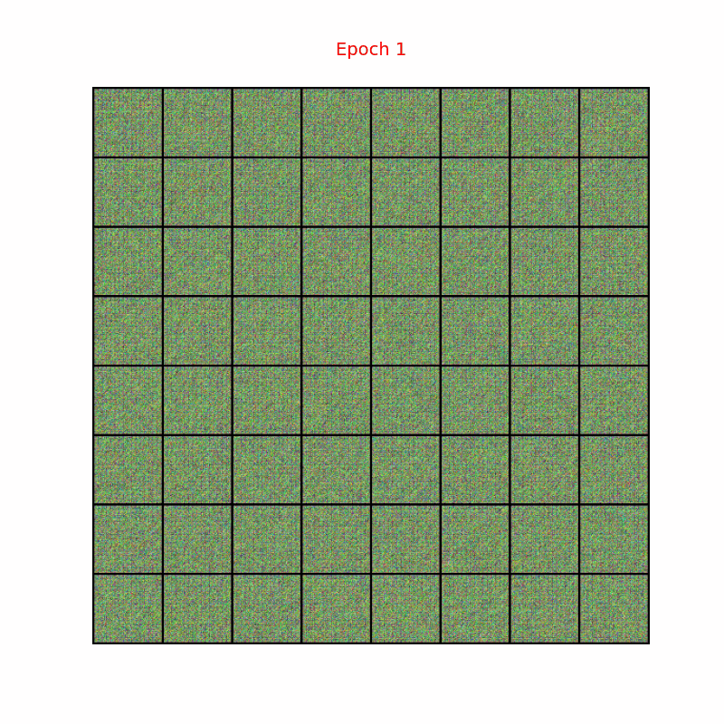
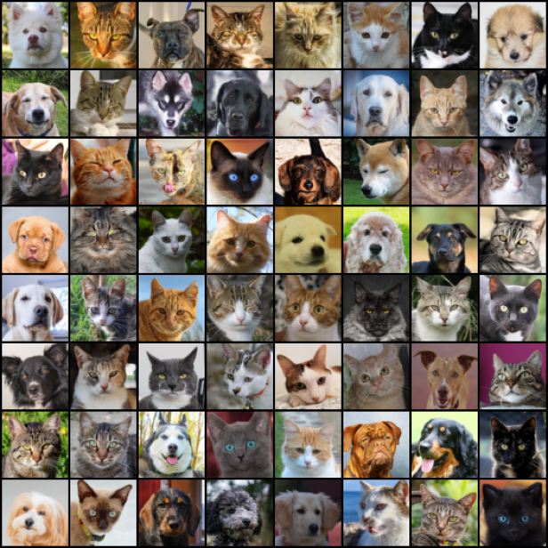
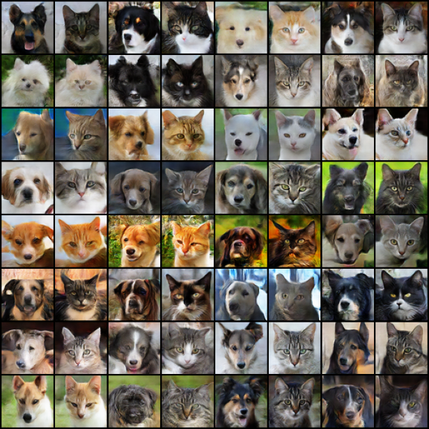

# Conditional GANs for Pet Image Generation (Dogs & Cats)
This repository uses **Conditional GANs** (**cGANs**, *Mirza* & *Osindero*, 2014) with **DCGANs** architecture (**Radford** et al., 2015), adding class labels to generate images of cats and dogs.

## Architecture
This project uses a DCGANs-based architecture, with full details provided in the [**DCGAN4Pet**](https://github.com/LeTienQuyet/DCGAN4Pet) repository. For the cGANs implementation, the Generator and Discriminator networks are each extended with a single embedding layer, which allows class labels to be effectively integrated into the model for controlled image generation of cats and dogs.
## Dataset
This project uses the **AFHQ-v2 (Animal Faces-HQ v2)** dataset, which contains high-quality animal face images. The original dataset consists of 3 classes: *cat*, *dog*, and *wild (wild animals)*. Only the cat and dog classes are included, while the wild class is excluded. Each image has a resolution of *512×512*. However, to enable faster training and more efficient metric evaluation, I use the 64×64 version available on [Hugging Face](https://huggingface.co/datasets/reese-green/afhq64_16k). The training set contains *9,892* images, while the development (dev/validation) set contains *1,000* images.
<p align="center">
  
</p>

## Experiments
<div align="center">

|      Embed dims    |  FID score     |  $\Delta\mathbf{FID}$ |
| :---------------:  | :--------:     | :--------:            | 
| 1                  |  **29.2134**   | **+2.0317**           |
| 2                  |  30.2553       | +0.9898               |
| 3                  |  31.9119       | -0.6668               |

**Table 1:** FID of cGANs models across label embedding dimensions and FID differences compared to [**DCGAN4Pet**](https://github.com/LeTienQuyet/DCGAN4Pet)
</div>

I have tried using larger values, such as 8 or 100, for both *G* and *D*, but they produced poor results. You might consider adjusting the architecture and testing these larger values again to potentially achieve better performance.

### Setting for training
Hyper-parameter values are set as follows:
```python
# Train
epoch = 300, batch_size = 128
# Model
num_dims = 100
# Optimizer
optimizer = Adam(lr=0.0002, betas=(0.5, 0.999))
```
### Result
Each dog-cat pair is generated from the same latent vector *z*, showing how the Generator changes output according to the label.
<p align="center">
  
</p>

## References
[1] **Mehdi Mirza**, **Simon Osindero**, (2014). *Conditional Generative Adversarial Nets*. [[arXiv]](https://arxiv.org/pdf/1411.1784)\
[2] **Alec Radford**,  **Luke Metz**, **Soumith Chintala** (2016). *Unsupervised representation learning with deep convolutional generative adversarial networks*. [[arXiv]](https://arxiv.org/pdf/1511.06434)\
[3] **Yunjey Choi**, **Youngjung Uh**, **Jaejun Yoo**, **Jung-Woo Ha**. *Animal Faces-HQ v2*. [[Dataset]](https://www.dropbox.com/scl/fi/0aha0j1yvhjdnr1r86u0g/afhq_v2.zip?rlkey=ji6v8s9tkma1vg87bwowi9v1e&e=2&dl=0)\
[4] **Ian J. Goodfellow**, **Jean Pouget-Abadie**, **Mehdi Mirza**, **Bing Xu**, **David Warde-Farley**, **Sherjil Ozair**, **Aaron Courville**, **Yoshua Bengio**. *Generative Adversarial Networks*. [[arXiv]](https://arxiv.org/pdf/1406.2661)